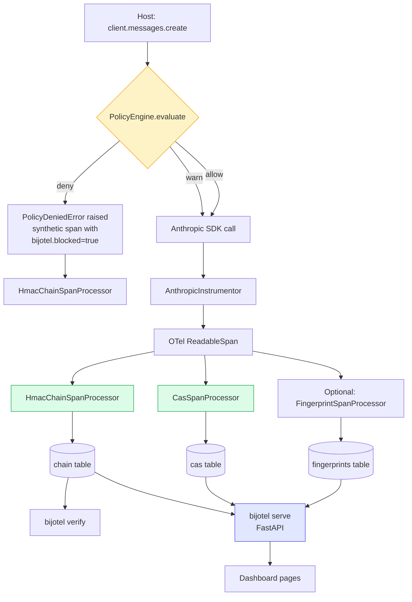
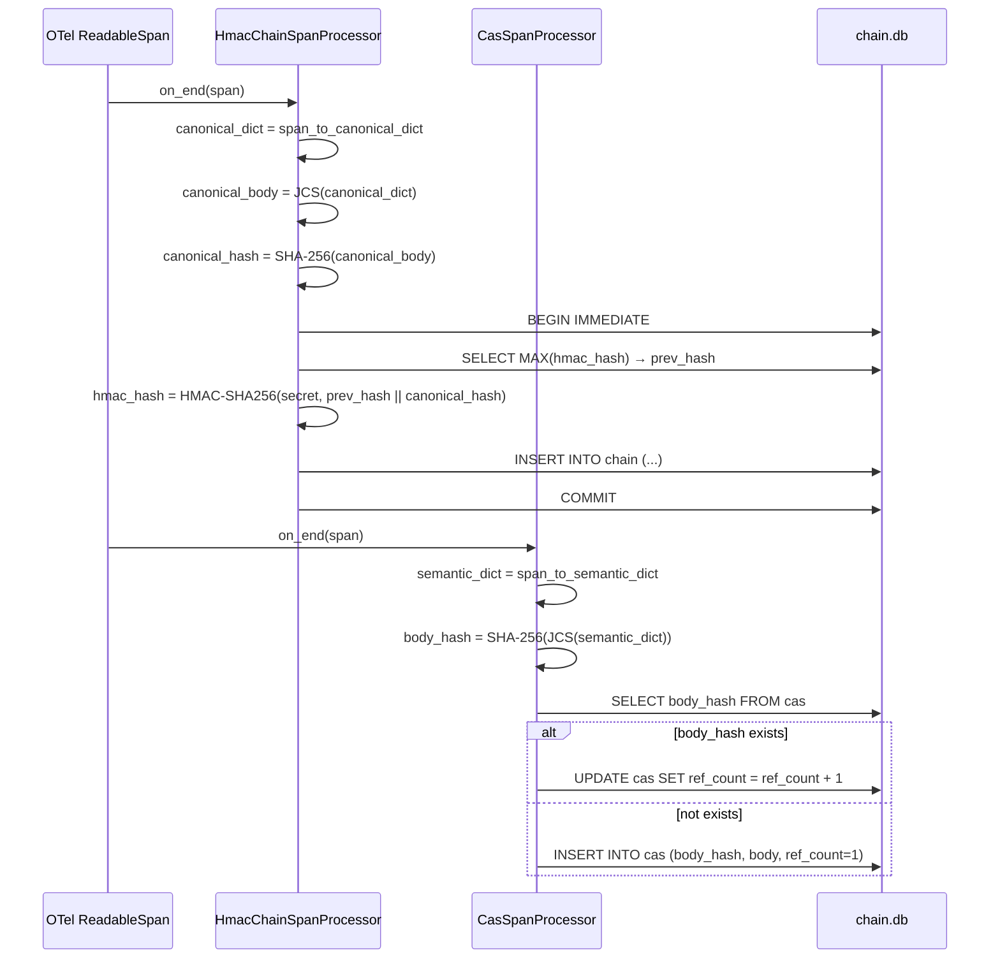
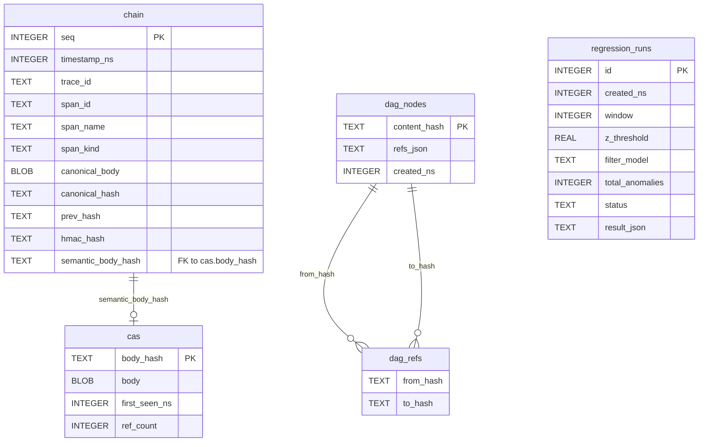
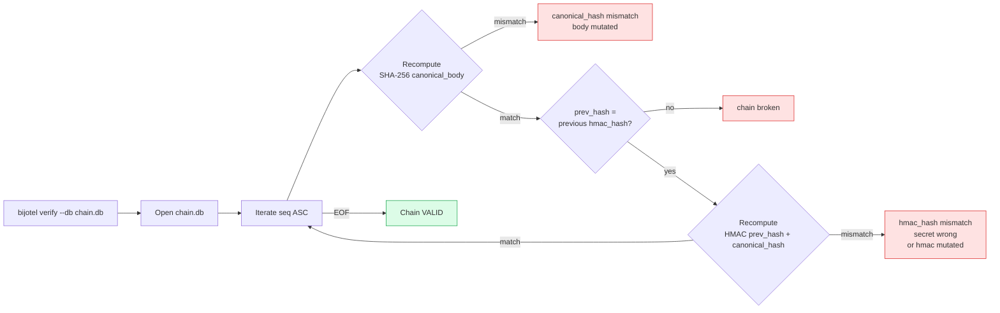
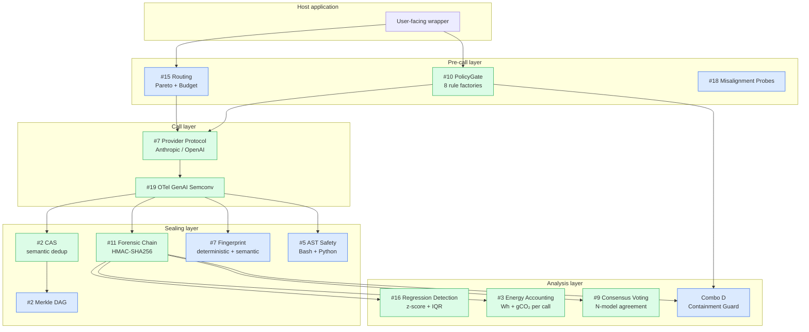
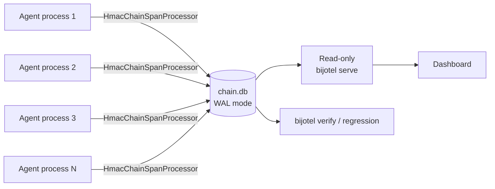
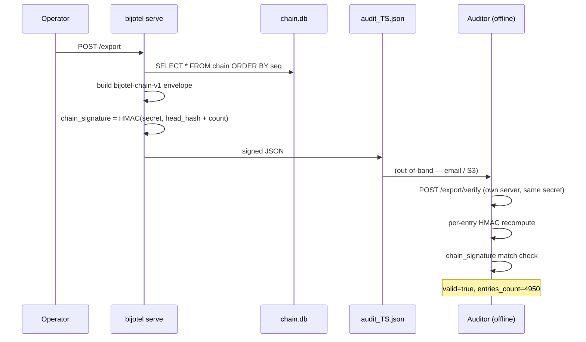
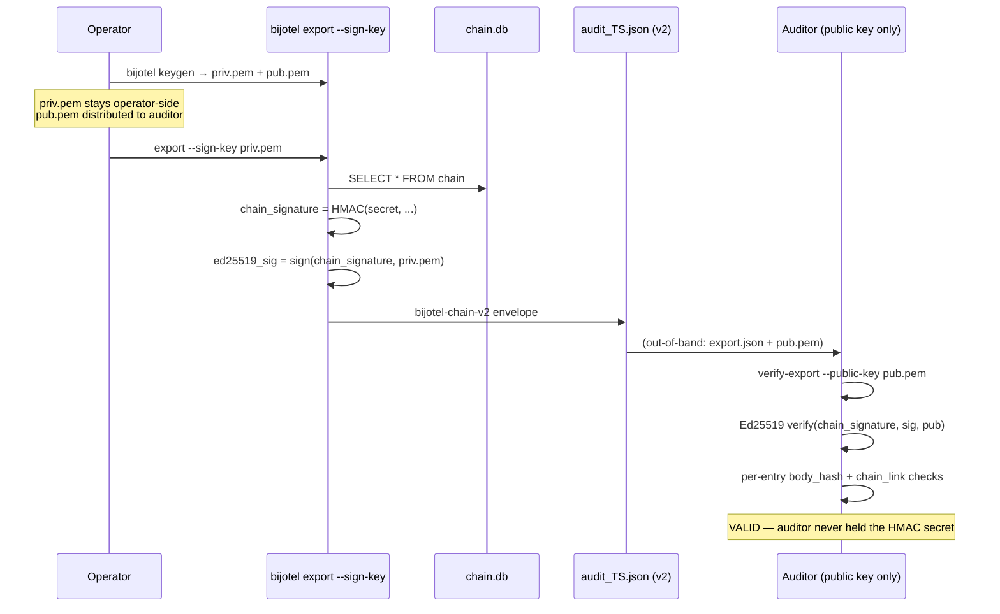
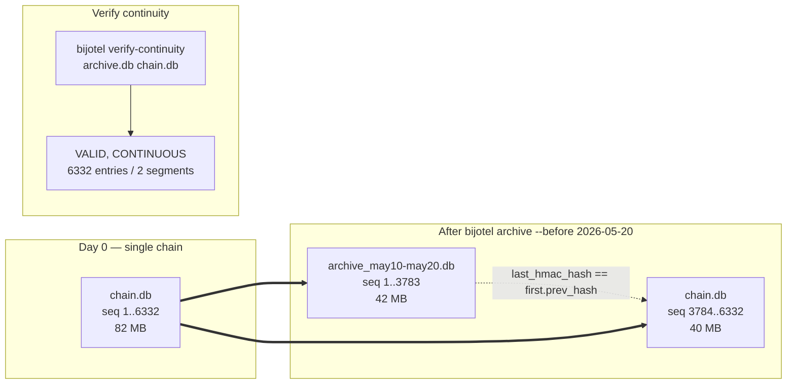

# BIJOTEL Architecture

This document covers the runtime call path, on-disk schema, and the
14-layer bijuterii positioning. Aimed at new contributors and at
auditors trying to convince themselves the chain integrity story is
real.

## Runtime call flow

When a host application makes an LLM call wrapped by BIJOTEL, the
following happens before the SDK reaches the network:

Key points:

* The **policy gate runs *before* the SDK** — no money spent on a
  request the policy would block.
* `deny` produces a **synthetic span** so the audit chain records the
  block (with `bijotel.blocked=true` attribute), not a silent
  refusal. The host receives `PolicyDeniedError`.
* `warn` does NOT short-circuit — the call proceeds, and the warning
  list attaches to the eventual span via `bijotel.policy.warning`.
* The host's existing `AnthropicInstrumentor` (or any OTel GenAI
  instrumentor) is the source of spans. BIJOTEL `SpanProcessor`s do
  **not** wrap the SDK call — they observe.

## Span sealing detail

* **JCS** = RFC 8785 JSON Canonicalization Scheme. Two different
  serializers of the same object produce the *same byte sequence*, so
  the hash is stable across SDK versions and Python interpreters.
* **BEGIN IMMEDIATE** acquires the RESERVED lock before the SELECT,
  serializing the SELECT-then-INSERT critical section across multiple
  writer processes that share the same chain.db. The `busy_timeout`
  PRAGMA makes concurrent writers wait up to 5 seconds instead of
  raising `SQLITE_BUSY`.

## On-disk schema (chain.db)

The five tables coexist inside a single SQLite file. The chain table
is the canonical source of truth (everything else is either dedup
storage or derived); deleting `cas` / `dag_*` / `regression_runs`
doesn't break verification, only loses dedup + history.

## Verification path

The same logic ships server-side in `POST /chain/verify` with
`full=true`. The CLI and the API give the same answer on the same
chain.db + secret.

## 14-layer bijuterii positioning

Green = active (runtime evidence present in this build, including the
GENA dual-observer deploy). Blue = available (code ships in the wheel,
host opts in via configuration). All 14 catalogued layers are now
shipped; no layer remains in the planned column.

## Deploy topologies

### Single-process

The simplest deploy: one Python process owns the chain.db. All
processors are local. Used by smoke tests and small projects.

### Multi-writer (production)

The pattern used on GENA (Day-10 integration test). Each agent
container has its own `HmacChainSpanProcessor` writing into a
shared `/data/bijotel_chain.db`. The chain stays linear and valid
because every writer holds RESERVED via `BEGIN IMMEDIATE` for the
critical SELECT-prev/INSERT section. WAL mode lets readers
(``bijotel serve``, ``bijotel verify``) coexist without blocking the
writers.

### Forensic export to auditor — symmetric (v1, default)

The auditor verifies with the **shared HMAC secret**. That secret has
to be transmitted out-of-band, and the auditor who holds it can also
*forge* valid chains. This is the trust limitation v2.1.0 was built
to close.

### Forensic export with Ed25519 attestation (v2.1.0+)

Auditor mode requirements (v2.1.0+):

- Operator holds the HMAC secret AND the Ed25519 *private* key.
- Auditor receives the export JSON AND the Ed25519 *public* key.
- Auditor cannot forge entries — they hold only verification material.
- Cross-architecture portability: a v2 export signed on x86_64
  verifies bit-identically on aarch64. Empirically confirmed
  2026-05-26 (GENA Nuremberg → ARA Helsinki, 6,341 entries).

### Chain segmentation and archival (v2.2.0+)

At scale the active `chain.db` is peeled into archive segments while
the boundary invariant `archive.last_hmac_hash ==
next_segment.first.prev_hash` proves no entries went missing.

Range-aware verify and export also live in v2.2.0:

- `bijotel verify --range 5000:6000` / `--since 2026-05-20` /
  `--until 2026-05-25` / `--last 1000`
- `bijotel export ... --range A:B` produces a `segment` block with
  `boundary_prev_hash` that the auditor anchors against, instead of
  GENESIS, when the slice doesn't start at seq=1.

See `docs/operations/chain-archival.md` for the operational playbook.

## Compatibility notes

* Python 3.11+ (uses `|` for union types, `tomllib`, etc.).
* OTel SDK 1.27.0+ for stable `gen_ai.*` attribute names.
* SQLite ≥ 3.35.0 for the `BEGIN IMMEDIATE` + WAL combo used by the
  hardening fix in v0.6.1.
* Tested OS: Linux (GENA production), macOS, Windows. Windows-specific
  caveats documented in README "Known issues".

---

For schema changes, see migration notes in the
[Changelog](changelog.md). For production integration evidence,
see the GENA + ARA chain stats reported in the
[Threat Model](threat-model.md) and the per-release notes on
[GitHub Releases](https://github.com/octavuntila-prog/BIJOTEL/releases).
